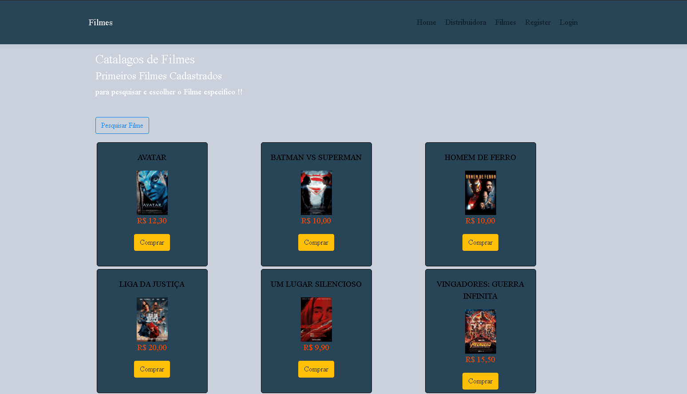
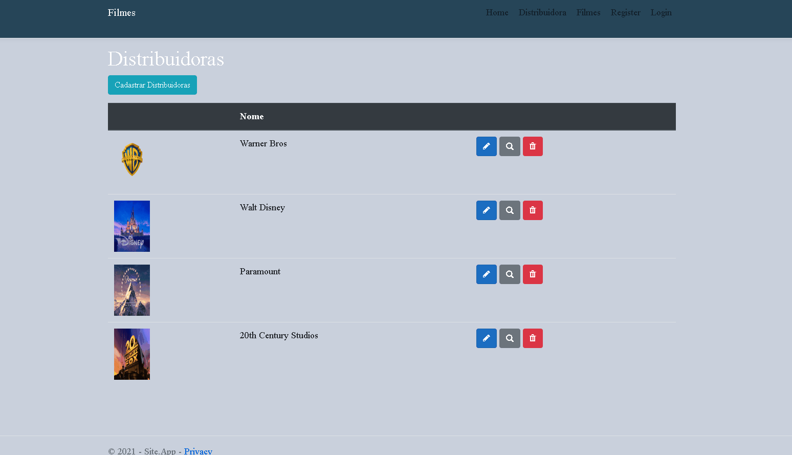

# Um projeto que fiz para absorver o conteúdo que aprendi no Curso Dominando o ASP.NET MVC Core

## Descrição

 Esse Projeto é um Site de uma "Locadora" server para comprar Filmes ele ainda esta em construção como diz no titulo foi para abordar e aplicar 
conteúdos que aprendi com o Curso Dominando o ASP.NET MVC Core

Usando boas praticas com o projeto em camadas com regras de negócio, usando tudo que o framework pode proporcionar !!

# Imagem da Home

da para pesquisar um Filme pelo nome !!

	
  
 # Detalhes das Distribuidoras
  nela da para ver as informações da distribuidoras e seus Filmes cadastrados
  
  

	

	  
# Mostrando como Cadastrar um Filme  
	  
	  
  

	
